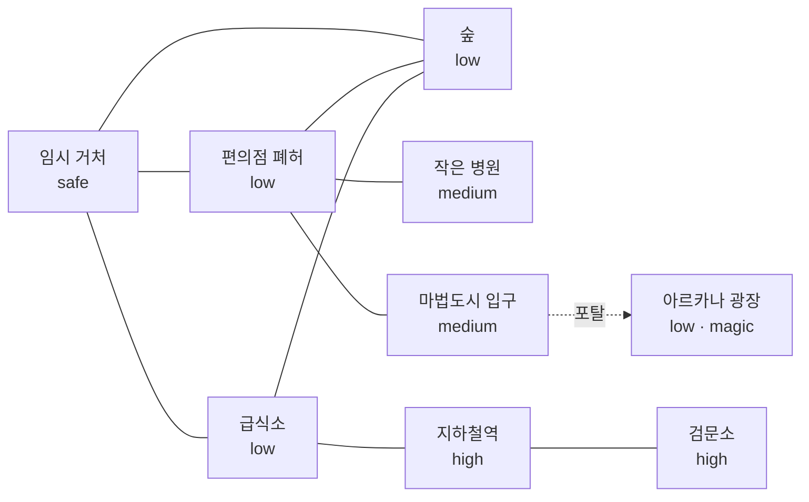

# 콘텐츠 장부

이 문서는 TextRPG의 **지역, 아이템, 아이템 효과와 획득·소모 흐름을 한곳에서 설계하는 원본 문서**다.

앞으로 콘텐츠를 바꾸고 싶을 때는 이 문서를 먼저 수정한다. 문서 수정만으로 게임 코드가 자동 변경되지는 않으며, 수정한 장부를 기준으로 `src/game/data/`와 관련 규칙 코드를 동기화한다.

- 코드 대조 기준: `codex/region-content-structure`
- 마지막 코드 대조일: 2026-07-28
- 현재 구현 규모: 지역 9곳, 아이템 29종

## 장부 편집 규칙

### 상태 표기

| 표기 | 의미 |
|---|---|
| `구현됨` | 현재 코드와 일치한다. |
| `변경 예정` | 장부에는 확정했지만 아직 코드에 반영하지 않았다. |
| `아이디어` | 검토 중인 후보이며 구현 대상으로 확정하지 않았다. |

### 콘텐츠를 수정할 때

- 기존 콘텐츠의 `id`는 저장 데이터와 코드가 참조하므로 가능하면 바꾸지 않는다.
- 이름, 설명, 가격, 효과 수치를 바꾸면 아이템 표와 관련 제작법·획득처도 함께 확인한다.
- 새 아이템에는 최소 한 곳의 획득처와 한 가지 이상의 사용 이유를 부여한다.
- 새 지역에는 방문 이유, 위험, 보상, 연결 지역을 모두 정한다.
- 수치가 아직 정해지지 않았다면 임의의 숫자를 넣지 말고 `미정`이라고 쓴다.
- 장부와 코드가 다르면 장부의 `변경 예정` 항목을 다음 구현 기준으로 삼는다.

### 주요 코드 위치

| 콘텐츠 | 코드 위치 |
|---|---|
| 아이템 정의와 기본 효과 | `src/game/data/items.ts` |
| 아이템 효과 스키마 | `src/game/schemas/item.ts` |
| 아이템 사용 규칙 | `src/game/rules.ts` |
| 지역 정의 | `src/game/data/regions/<regionId>/location.ts` |
| 거처 제작·요리 | `src/game/data/regions/shelter/choices.ts` |
| 지하철 탐험 전리품 | `src/game/subway-loot.ts` |

## 아이템 효과 규칙

### 능력치

| 코드 키 | 장부 표기 | 의미 | 현재 범위 |
|---|---|---|---|
| `hp` | 체력 | 생존 상태. 0이 되면 게임 오버가 될 수 있다. | 0~10 |
| `mind` | 정신력 | 심리적 버팀 상태. 0이 되면 게임 오버가 될 수 있다. | 0~10 |
| `energy` | 기력 | 행동과 시간 경과에 사용하는 활동 자원이다. | 0~15 |
| `exhaustionRelief` | 탈진 완화 | 기력이 0인 동안 누적되는 탈진 단계를 낮춘다. | 0 이상 |

- 표에 적지 않은 효과 값은 `0`이다.
- 회복으로 최대치를 넘는 값은 최대치에서 멈춘다.
- 아이템을 직접 사용하면 인벤토리에서 1개가 사라진다.
- 현재 직접 사용할 수 있는 분류는 `food`, `drink`, `medicine`뿐이다.
- `useMinutes`가 없으면 현재 구현상 시간이 흐르지 않는다.
- 도구는 직접 사용하는 소비 아이템이 아니라, 특정 행동의 조건과 효율 보너스로 쓰인다.
- 도구 내구도가 0이 되면 해당 도구 1개가 인벤토리에서 사라진다.

### 효과 표기 예시

```text
체력 +2
정신력 +1 / 기력 +6 / 탈진 완화 +3
효과 없음
```

## 아이템 총괄

### 생존 음식·음료·약품

| 상태 | id | 이름 | 분류 | 희귀도 | 기준 가격 | 직접 사용 효과 | 사용 시간 | 획득처와 설계 역할 |
|---|---|---|---|---|---:|---|---:|---|
| 구현됨 | `emergencySnack` | 비상식량 | food | common | 1,500원 | 기력 +5 / 탈진 완화 +1 | 0분 | 시작 인벤토리, 지하철 탐험. 초반 안전망이며 사용 시 오늘의 식사 확보로 인정된다. |
| 구현됨 | `cannedFood` | 캔 음식 | food | common | 2,500원 | 기력 +5 / 탈진 완화 +2 | 10분 | 편의점 진열대, 숲 수색, 지하철 탐험. 첫 퀘스트 물품이며 사용 시 오늘의 식사 확보로 인정된다. |
| 구현됨 | `hotMeal` | 따뜻한 식사 | food | uncommon | 4,500원 | 정신력 +1 / 기력 +6 / 탈진 완화 +3 | 0분 | 급식소 구매·배식권 교환, 거처 요리. 사용 시 오늘의 식사 확보로 인정된다. |
| 구현됨 | `waterBottle` | 물병 | drink | common | 1,200원 | 정신력 +1 / 기력 +1 / 탈진 완화 +1 | 0분 | 시작 인벤토리, 편의점·급식소·거처·지하철역과 지하철 탐험. 사용 시 오늘의 물 확보로 인정된다. |
| 구현됨 | `painRelief` | 진통제 | medicine | uncommon | 3,800원 | 체력 +2 | 0분 | 병원, 검문소, 지하철 탐험. 위험 지역의 직접 회복 보상이다. |
| 구현됨 | `rawRice` | 쌀 | food | common | 800원 | 효과 없음 | 0분 | 편의점 보관함, 급식소 식재료 상자. 거처 요리의 핵심 재료다. |
| 구현됨 | `vegetables` | 채소 | food | common | 600원 | 효과 없음 | 0분 | 급식소 식재료 상자와 숲 채집. 따뜻한 식사의 재료다. |
| 구현됨 | `meat` | 고기 | food | common | 1,500원 | 효과 없음 | 0분 | 조리용 식재료. 고정 획득처와 요리법은 아직 없다. |
| 구현됨 | `staleBread` | 눅눅한 빵 | food | common | 900원 | 기력 +2 / 탈진 완화 +1 | 10분 | 편의점 보관함, 숲 채집, 지하철 탐험. 낮은 등급의 간식이다. |
| 구현됨 | `ricePorridge` | 묽은 죽 | food | common | 0원 | 정신력 +1 / 기력 +4 / 탈진 완화 +2 | 10분 | 거처 요리. 채소 없이 쌀과 물로 만드는 기본 회복식이다. |

### 재료·도구·교환품·목표품

| 상태 | id | 이름 | 분류 | 희귀도 | 기준 가격 | 효과·내구도 | 주요 획득처 | 주요 사용처 |
|---|---|---|---|---|---:|---|---|---|
| 구현됨 | `scrapBundle` | 교환용 잡화 | trade | common | 1,800원 | 직접 사용 불가 | 고정 획득처 없음 | 거래 콘텐츠 확장 후보 |
| 구현됨 | `rationTicket` | 배식권 | ticket | common | 0원 | 직접 사용 불가 | 검문소 | 급식소에서 따뜻한 식사 1개로 교환 |
| 구현됨 | `wood` | 목재 | material | common | 500원 | 직접 사용 불가 | 숲 벌목 | 판자와 땔감 가공의 원재료 |
| 구현됨 | `woodPlank` | 목재 판자 | material | common | 700원 | 직접 사용 불가 | 거처 가공, 편의점·숲 수색 | 거처 보강, 화로, 손도끼 |
| 구현됨 | `firewood` | 땔감 | material | common | 100원 | 직접 사용 불가 | 거처 가공 | 요리 연료, 1회에 1개 소비 |
| 구현됨 | `scrapMetal` | 고철 조각 | material | common | 900원 | 직접 사용 불가 | 편의점, 숲, 급식소, 지하철역, 검문소 | 시설·도구·무전기 제작 |
| 구현됨 | `clothScrap` | 천 조각 | material | common | 500원 | 직접 사용 불가 | 편의점, 숲, 급식소, 병원, 지하철 탐험 | 시설·도구·무전기 제작 |
| 구현됨 | `cordage` | 끈 묶음 | material | common | 600원 | 직접 사용 불가 | 편의점, 숲, 급식소, 병원, 지하철 탐험, 검문소 | 거의 모든 시설·도구·무전기 제작 |
| 구현됨 | `crudeAxe` | 손도끼 | tool | uncommon | 0원 | 최대 내구도 8 | 거처 제작 | 숲 벌목 보상 증가: 목재 3개 → 5개 |
| 구현됨 | `utilityKnife` | 간이 칼 | tool | uncommon | 0원 | 최대 내구도 10 | 거처 제작 | 숲 덩굴 채집 보상 증가, 먹을거리 수색 확률 개선 |
| 구현됨 | `dentedPot` | 찌그러진 냄비 | tool | uncommon | 0원 | 최대 내구도 12 | 거처 제작 | 거처 요리 필수 도구, 요리 1회마다 내구도 1 소모 |
| 구현됨 | `radioBattery` | 무전기 배터리 | material | rare | 0원 | 직접 사용 불가 | 병원 약품 보관함 | 구조 무전기 조립 조건 |
| 구현됨 | `radioAntenna` | 무전기 안테나 | material | rare | 0원 | 직접 사용 불가 | 지하철역 신호함, 지하철 탐험 | 구조 무전기 조립 조건 |
| 구현됨 | `radioTransmitter` | 무전기 송신기 | material | rare | 0원 | 직접 사용 불가 | 검문소 통신 차량 | 구조 무전기 조립 조건 |
| 구현됨 | `manaShard` | 마력 결정 파편 | material | rare | 0원 | 직접 사용 불가 | 현재 고정 획득처 없음 | 룬 나침반 제작 |
| 구현됨 | `moonHerb` | 달빛 약초 | material | common | 0원 | 직접 사용 불가 | 아르카나 광장 채집 | 마나 포션 연금 |
| 구현됨 | `arcaneDust` | 비전 가루 | material | uncommon | 0원 | 직접 사용 불가 | 아르카나 광장 부유 룬 해독 | 마나 포션·룬 나침반 제작 |
| 구현됨 | `manaPotion` | 마나 포션 | drink | uncommon | 0원 | MP +4 | 아르카나 광장 비전 작업대 | 마법세계 MP 회복 |
| 구현됨 | `runeCompass` | 룬 나침반 | tool | rare | 0원 | 최대 내구도 12 | 아르카나 광장 비전 작업대 | 마법도시의 후속 지역 탐색 확장 |

## 제작과 요리

### 거처 시설·도구·목표 제작

| 상태 | 결과 | 필요 조건·재료 | 시간 | 결과 효과 |
|---|---|---|---:|---|
| 구현됨 | 목재 판자 1 | 목재 1 | 10분 | 시설과 도구 제작 재료 |
| 구현됨 | 땔감 4 | 목재 1 | 10분 | 요리 연료 |
| 구현됨 | 거처 보강 | 목재 판자 1 / 천 조각 2 / 끈 묶음 1 | 15분 | 이후 취침 시 체력 +1, 정신력 +1을 추가 회복한다. |
| 구현됨 | 간이 화로 | 고철 조각 2 / 목재 판자 1 / 끈 묶음 1 | 15분 | 거처 요리를 해금한다. |
| 구현됨 | 빗물통 | 고철 조각 1 / 천 조각 1 / 끈 묶음 1 | 15분 | 하루 한 번 물병 1개를 얻을 수 있다. 물 확보에는 별도 15분이 든다. |
| 구현됨 | 손도끼 | 고철 조각 2 / 목재 판자 1 / 천 조각 1 / 끈 묶음 1 | 30분 | 손도끼 1개, 내구도 8 |
| 구현됨 | 간이 칼 | 고철 조각 1 / 천 조각 1 / 끈 묶음 1 | 20분 | 간이 칼 1개, 내구도 10 |
| 구현됨 | 찌그러진 냄비 | 고철 조각 2 / 천 조각 1 / 끈 묶음 1 | 20분 | 찌그러진 냄비 1개, 내구도 12 |
| 구현됨 | 구조 무전기 | 배터리 1 / 안테나 1 / 송신기 1 / 고철 조각 2 / 천 조각 1 / 끈 묶음 1 | 15분 | `rescue_signal_ready`를 활성화해 10일차 구조 성공 조건을 만족한다. |

### 요리

모든 요리는 간이 화로와 땔감 1개가 필요하다. 따뜻한 식사와 묽은 죽은 찌그러진 냄비도 필요하며, 냄비 내구도 1을 소모한다.

| 상태 | 결과 | 소모 재료 | 조리 시간 | 완성품 사용 효과 |
|---|---|---|---:|---|
| 구현됨 | 따뜻한 식사 1 | 쌀 1 / 채소 1 / 물병 1 / 땔감 1 | 25분 | 정신력 +1 / 기력 +6 / 탈진 완화 +3 |
| 구현됨 | 묽은 죽 1 | 쌀 1 / 물병 1 / 땔감 1 | 20분 | 정신력 +1 / 기력 +4 / 탈진 완화 +2 |
| 구현됨 | 생선구이 1 | 민물고기 1 / 땔감 1 | 15분 | 기력 +3 |

### 마법세계 연금·마도구

마법세계에서는 현실의 제작 재료 대신 달빛 약초, 비전 가루, 마력 결정을 사용한다.

| 상태 | 결과 | 소모 재료 | 제작 시간 | 결과 효과 |
|---|---|---|---:|---|
| 구현됨 | 마나 포션 1 | 달빛 약초 2 / 비전 가루 1 | 20분 | MP +4 |
| 구현됨 | 룬 나침반 1 | 마력 결정 파편 1 / 비전 가루 2 | 30분 | 마법도시 후속 지역 탐색용 마도구 |

## 현재 구현에서 확인된 설계 불일치

이 표는 버그로 단정하지 않고, 장부를 수정할 때 의도부터 결정해야 하는 항목을 모은다.

| 상태 | 항목 | 현재 구현 | 결정할 내용 |
|---|---|---|---|
| 검토 필요 | 생쌀·채소 직접 사용 | `food` 분류라 직접 사용할 수 있지만 효과 없이 1개가 사라진다. | 직접 사용을 막을지, 작은 효과를 줄지 결정 |
| 검토 필요 | 조리 음식의 식사 인정 | 비상식량·캔 음식·따뜻한 식사만 `mealSecured`를 켠다. 묽은 죽은 켜지 않는다. | 모든 완성 요리를 식사로 인정할지 결정 |
| 검토 필요 | 즉시 사용 아이템 | 비상식량·따뜻한 식사·물병·진통제는 사용 시간이 0분이다. | 공통 사용 시간을 둘지 결정 |
| 검토 필요 | 무전기 핵심 부품 소모 | 배터리·안테나·송신기는 보유 조건만 확인하고 조립 후에도 남는다. 고철·천·끈만 소모된다. | 핵심 부품도 소모할지 결정 |
| 검토 필요 | 무전기 선택지 안내 | 실제 조건에는 끈 묶음 1개가 필요하지만 짧은 `outcomeHint`에는 빠져 있다. | 안내 문구에 끈을 추가 |
| 검토 필요 | `scrapBundle` | 아이템은 정의됐지만 고정 획득처와 사용처가 없다. | 거래 루프를 만들거나 아이템을 보류 |

## 지역 지도



## 지역 총괄

| 상태 | id | 이름 | 위험도 | 방문 이유와 정체성 | 주요 획득 아이템 | 연결 지역 |
|---|---|---|---|---|---|---|
| 구현됨 | `shelter` | 임시 거처 | safe | 휴식·취침·제작·요리·빗물 확보·구조 신호 완성의 중심 거점 | 비상식량, 물병, 완성 요리, 제작 도구와 시설 | 편의점 폐허, 급식소, 숲 |
| 구현됨 | `convenience` | 편의점 폐허 | low | 초반 식량·현금·제작 재료를 한정된 재고에서 확보하는 장소 | 캔 음식, 눅눅한 빵, 물병, 쌀, 목재, 고철, 천, 끈 | 임시 거처, 작은 병원, 숲 |
| 구현됨 | `kitchen` | 급식소 | low | 식사 구매와 교환, 일거리, 소문, 조리 재료 확보가 모이는 생활 거점 | 따뜻한 식사, 배식권, 물병, 쌀, 채소, 고철, 천, 끈 | 임시 거처, 지하철역, 숲 |
| 구현됨 | `forest` | 숲 | low | 시간과 도구 내구도를 자원으로 바꾸는 반복 채집 지역 | 목재, 끈, 채소, 눅눅한 빵, 캔 음식, 고철, 천 | 임시 거처, 편의점 폐허, 급식소 |
| 구현됨 | `hospital` | 작은 병원 | medium | 돈을 내고 치료하거나 일을 도우며 약품·배터리를 확보하는 장소 | 진통제, 천, 끈, 무전기 배터리 | 편의점 폐허 |
| 구현됨 | `subway` | 지하철역 | high | 안테나 확보와 장기 심층 탐험을 시작하는 고위험 지역. 새 심층 탐험의 지하 1층에서는 LLM 강도 조우가 발생한다. | 무전기 안테나, 강도 격퇴 보상(캔 음식·진통제), 고철, 끈, 천, 물, 식량 | 급식소, 검문소 |
| 구현됨 | `checkpoint` | 검문소 | high | 송신기와 구조 소문을 확인하고 위험한 외곽 정찰을 하는 후반 지역 | 무전기 송신기, 진통제, 배식권, 고철, 끈 | 지하철역 |
| 구현됨 | `magic_city_entrance` | 마법도시 입구 | medium | 편의점 옥상에서 현실과 확장 세계를 잇는 포탈을 발견하고 통과하는 경계 지역 | 없음 | 편의점 폐허, 포탈 너머 아르카나 광장 |
| 구현됨 | `arcana_plaza` | 아르카나 광장 | low | MP와 마법 전용 재료·레시피를 사용하는 판타지 확장판의 첫 거점 | 달빛 약초, 비전 가루, 마나 포션, 룬 나침반 | 포탈 너머 마법도시 입구 |

## 고정 재고

고정 재고는 한 번 획득하면 다시 채워지지 않는 지역 물자다.

| 지역 | node id | 이름 | 초기 내용물 |
|---|---|---|---|
| 편의점 폐허 | `convenience_shelf` | 진열대 | 캔 음식 3 |
| 편의점 폐허 | `convenience_register` | 계산대 | 1,800원 |
| 편의점 폐허 | `convenience_food_crate` | 보관함 | 눅눅한 빵 2 / 물병 1 / 쌀 1 |
| 편의점 폐허 | `convenience_supply_pile` | 창고 자재 더미 | 목재 판자 3 / 천 조각 4 / 고철 조각 3 / 끈 묶음 3 |
| 급식소 | `kitchen_scrap_heap` | 폐자재 더미 | 고철 조각 4 / 천 조각 4 / 끈 묶음 3 |
| 급식소 | `kitchen_ingredient_crate` | 식재료 상자 | 쌀 2 / 채소 2 / 물병 1 |
| 작은 병원 | `hospital_medicine_cabinet` | 약품 보관함 | 진통제 2 / 천 조각 2 / 끈 묶음 2 / 무전기 배터리 1 |
| 지하철역 | `subway_signal_box` | 역무실 신호함 | 무전기 안테나 1 / 고철 조각 2 / 물병 1 |
| 검문소 | `checkpoint_radio_truck` | 통신 차량 | 무전기 송신기 1 / 진통제 1 / 배식권 1 |

## 반복 획득 루프

| 지역·행동 | 비용 | 결과 |
|---|---|---|
| 숲 벌목 | 30분 | 목재 3 |
| 숲 손도끼 벌목 | 30분 / 손도끼 내구도 1 | 목재 5 |
| 숲 일반 수색 | 30분 | 빈손 50% / 캔 음식 1 10% / 목재 판자 1 20% / 고철 1 10% / 천 1 10% |
| 숲 끈 만들기 | 30분 | 끈 묶음 2 |
| 숲 간이 칼 덩굴 채집 | 30분 / 간이 칼 내구도 1 | 끈 묶음 4 |
| 숲 먹을거리 채집 | 30분 | 빈손 55% / 채소 1 25% / 눅눅한 빵 1 10% / 천 1 10% |
| 숲 간이 칼 먹을거리 수색 | 30분 / 간이 칼 내구도 1 | 빈손 35% / 채소 1 35% / 눅눅한 빵 1 15% / 캔 음식 1 10% / 천 1 5% |
| 급식소 일 돕기 | 60분 | 5,000원 |
| 병원 처치대 돕기 | 기력 1 / 35분 | 진통제 1 30% / 천 1 30% / 끈 1 20% / 체력 +1 20% |
| 검문소 외곽 정찰 | 기력 1 / 35분 | 고철 2 35% / 끈 1 25% / 배식권 1 20% / 체력 -1 20% |
| 아르카나 광장 달빛 약초 채집 | 20분 | 달빛 약초 1 |
| 아르카나 광장 부유 룬 해독 | MP 1 / 15분 | 비전 가루 1 |

### 지하철 심층 탐험 전리품

각 층에서 아래 항목을 독립적으로 판정한 뒤 세 곳의 수색 지점에 나눠 배치한다. 안테나는 이미 보유·운반·배치 중이면 더 나오지 않는 고유 아이템이다.

| 깊이 | 층별 전리품 판정 |
|---|---|
| 1~10층 | 고철 1~2 50% / 끈 1 35% / 천 1~2 30% / 물병 1 25% / 눅눅한 빵 1 20% / 비상식량 1 10% / 진통제 1 8% / 안테나 1 6% |
| 11~20층 | 고철 2~3 70% / 끈 1~2 50% / 천 1~2 45% / 물병 1~2 40% / 비상식량 1 30% / 캔 음식 1 22% / 진통제 1 25% / 안테나 1 12% |
| 21층 이상 | 고철 2~4 80% / 끈 1~3 65% / 천 1~3 55% / 물병 1~2 50% / 비상식량 1~2 40% / 캔 음식 1~2 40% / 진통제 1~2 40% / 안테나 1 18% |

## 10일 시나리오 골격

| 시점 | 사건 | 플레이어에게 주는 정보 | 시스템 효과 | 상태 |
|---|---|---|---|---|
| 1일차 | 프롤로그 | 오늘부터는 살아남아야 한다. | 첫 퀘스트와 거처 시작 | 구현됨 |
| 2일차 | 피난민 증가 | 급식소가 붐비고 식사 가격이 오른다. | 따뜻한 식사 가격 4,500원 → 5,200원 | 구현됨 |
| 4일차 | 병원 소문 | 약품과 무전기 배터리 단서를 준다. | 병원 방문 유도 | 구현됨 |
| 6일차 | 지하철역 단서 | 안테나를 찾을 수 있다는 정보를 준다. | 지하철역 방문 유도 | 구현됨 |
| 8일차 | 검문소 소문 | 구조 주파수와 송신기 정보를 준다. | 검문소 방문 유도 | 구현됨 |
| 10일차 | 구조 판정 | 신호 완성 여부에 따라 결말이 갈린다. | `stageClear` 또는 게임 오버 | 구현됨 |

## 밸런스와 콘텐츠 후보

| 상태 | 항목 | 설계 방향 |
|---|---|---|
| 아이디어 | 물과 식량 역할 분리 | 물은 정신력·위험 완화, 음식은 기력·탈진 완화 중심으로 구분한다. |
| 아이디어 | 교환용 잡화 루프 | 급식소, 병원 또는 생존자 거래에서 현금 대체 자원으로 사용한다. |
| 아이디어 | 병원 사건 | 남은 간호 기록이나 부상자 선택지를 추가한다. |
| 아이디어 | 지하철 압박 | 탐험 깊이에 따라 정신력 압박과 귀환 판단을 강화한다. |
| 아이디어 | 검문소 긴장 | 8일차 이후 외곽 정찰의 위험과 보상을 변화시킨다. |
| 아이디어 | 결말 분화 | 구조 성공·실패 이유에 따라 짧은 엔딩 문구를 나눈다. |

## 콘텐츠 추가 체크리스트

### 아이템

- [ ] 기존 아이템과 겹치지 않는 영문 `id`가 있는가?
- [ ] 이름과 설명만 읽어도 세계 안에서 어떤 물건인지 알 수 있는가?
- [ ] 획득처가 최소 1곳 있는가?
- [ ] 직접 사용, 제작 재료, 교환, 퀘스트 중 최소 한 가지 역할이 있는가?
- [ ] 가격과 희귀도가 획득 난이도에 맞는가?
- [ ] 음식·음료·약품이면 효과와 사용 시간이 정해졌는가?
- [ ] 도구면 최대 내구도와 내구도를 소모하는 행동이 정해졌는가?

### 지역

- [ ] 방문 이유를 한 문장으로 설명할 수 있는가?
- [ ] 위험도와 보상이 맞물리는가?
- [ ] 연결된 기존 지역과 이동 이유가 자연스러운가?
- [ ] 고정 재고와 반복 보상을 구분했는가?
- [ ] 해당 지역만의 인물, 사건, 행동 중 최소 하나가 있는가?
- [ ] 주요 획득 아이템이 실제 선택지나 재고에 연결되어 있는가?

### 제작·요리

- [ ] 결과물의 획득처가 제작뿐이라면 재료 수급이 막히지 않는가?
- [ ] 재료 소모량, 시간, 도구 내구도가 모두 적혀 있는가?
- [ ] 같은 재료를 쓰는 다른 제작법과 비교해 효율이 납득되는가?
- [ ] UI의 결과 안내와 실제 코드 효과가 일치하는가?
